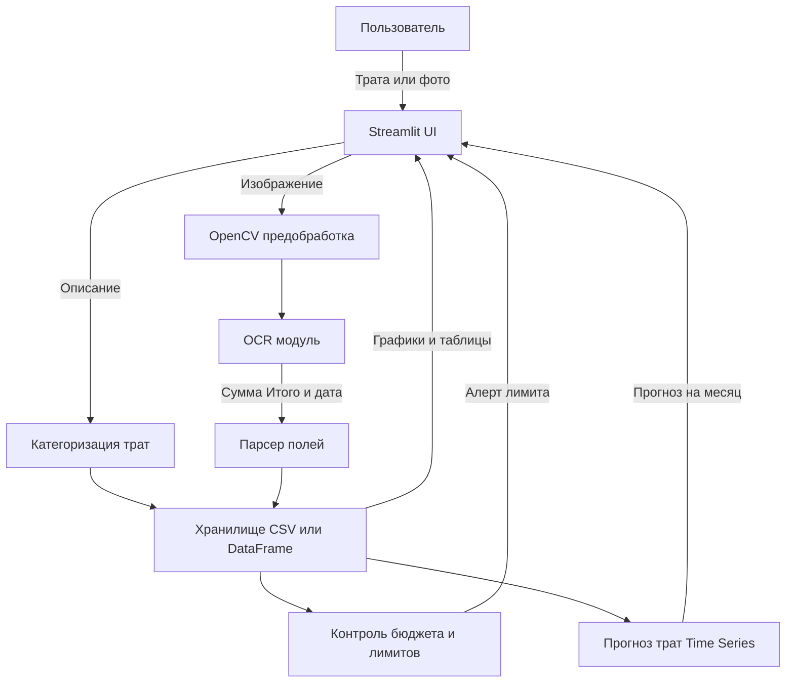

# SpendFlow: Финансы — учет расходов

## Описание
**SpendFlow** — учебный проект для учета личных расходов: добавление трат (вручную и по фото чека), автоматическая категоризация, контроль бюджета и прогноз трат на следующий месяц.

Цель проекта: собрать понятный **дашборд расходов** и базовую “умную” логику вокруг трат (категории, лимиты, прогноз).

---

## Функциональность (4 этапа)

### 1) Контроль бюджета
- Задача: контроль лимитов по бюджету
- Правило: **алерт при перерасходе** (например, при превышении лимита категории или общего бюджета)

### 2) Категоризация трат
- Задача: автоматически определять категорию по описанию
- Пример: `"Uber" → "Transport"`
- Подход: старт — правила/словарь, далее — ML-модель (по датасету)

### 3) Чтение чеков (OCR)
- Задача: распознать чек и вытащить ключевые поля
- Цель: извлечь **сумму “Итого”** (и по возможности дату)

### 4) Интеграция и прогноз (Time Series)
- Задача: прогноз трат на **следующий месяц**
- UI: дашборд с графиком расходов + **красная зона лимита**

---

## Реализовано в текущей версии

- **Rule-based логика контроля бюджета**  
  - База правил в `data/raw/rules.json` (лимиты по категориям и общему бюджету).  
  - Продукционная модель в `src/logic.py` (`check_rules`) — алерты и предупреждения при перерасходе.  
  - Дашборд в `src/main.py` с карточками метрик и визуальными алертами.

- **Граф знаний (Knowledge Graph)**  
  - Граф `networkx.Graph` в `src/knowledge_graph.py` с узлами *магазин*, *категория*, *подкатегория*.  
  - Визуализация графа в Streamlit (кружки‑узлы, линии‑связи).  
  - Блок *Knowledge Graph Explorer* — выбор узла и просмотр связанных сущностей.

- **Диалоговый интерфейс (Chatbot)**  
  - Функция `process_text_message` в `src/logic.py`, которая ищет термины в графе знаний.  
  - Чат-интерфейс внизу `src/main.py` на основе `st.chat_message` и `st.chat_input` с историей в `st.session_state`.

- **AI‑категоризация расходов (ML‑классификатор)**  
  - Модуль `src/ml_classifier.py` — TF‑IDF + `LogisticRegression` (scikit‑learn) по тексту описания траты.  
  - В `src/main.py` рядом с деталями транзакции отображается **ML‑предсказание категории** и вероятность.

---

## Tech Stack
Текущее:
- `streamlit` — UI/дашборд и загрузка чеков
- `pandas`, `numpy` — хранение/агрегации/аналитика
- `opencv-python-headless` — предобработка изображений чеков (контраст, шум, обрезка)
- `networkx` — граф знаний (магазины ↔ категории)
- `matplotlib` — визуализация графа знаний
- `scikit-learn` — ML‑классификатор категории расходов по описанию
- `notebook` — эксперименты и исследование данных

Планируется по мере усложнения (опционально):
- OCR: `pytesseract` / `easyocr`
- Дополнительные ML‑модели: глубокие сети, более сложные пайплайны
- Прогноз: `statsmodels` / `prophet`

---

## Структура проекта
data/ # данные (чеки/таблицы), локальные датасеты  
docs/ # документация (скриншоты/схемы/описания)  
notebooks/ # эксперименты и исследования в Jupyter  
src/  
main.py # точка входа (Streamlit app)  
.gitignore  
Pipfile  
Pipfile.lock  
README.md

---

## Архитектура (потоки данных)

# SpendFlow: Финансы — учет расходов

## Описание
**SpendFlow** — учебный проект для учета личных расходов: добавление трат (вручную и по фото чека), автоматическая категоризация, контроль бюджета и прогноз трат на следующий месяц.

Цель проекта: собрать понятный **дашборд расходов** и базовую “умную” логику вокруг трат (категории, лимиты, прогноз).

---

## Функциональность (4 этапа)

### 1) Контроль бюджета
- Задача: контроль лимитов по бюджету
- Правило: **алерт при перерасходе** (например, при превышении лимита категории или общего бюджета)

### 2) Категоризация трат
- Задача: автоматически определять категорию по описанию
- Пример: `"Uber" → "Transport"`
- Подход: старт — правила/словарь, далее — ML-модель (по датасету)

### 3) Чтение чеков (OCR)
- Задача: распознать чек и вытащить ключевые поля
- Цель: извлечь **сумму “Итого”** (и по возможности дату)

### 4) Интеграция и прогноз (Time Series)
- Задача: прогноз трат на **следующий месяц**
- UI: дашборд с графиком расходов + **красная зона лимита**

---

## Реализовано в учебной версии

- **Лабораторная 2 — Rule-Based Logic**  
  - База правил в `data/raw/rules.json` (лимиты по категориям и общему бюджету).  
  - Продукционная модель в `src/logic.py` (`check_rules`) — алерты и предупреждения при перерасходе.  
  - Дашборд в `src/main.py` с карточками метрик и визуальными алертами.

- **Лабораторная 3 — Граф знаний (Knowledge Graph)**  
  - Граф `networkx.Graph` в `src/knowledge_graph.py` с узлами *магазин*, *категория*, *подкатегория*.  
  - Визуализация графа в Streamlit (кружки‑узлы, линии‑связи).  
  - Блок *Knowledge Graph Explorer* — выбор узла и просмотр связанных сущностей.

- **Лабораторная 4 — Диалоговый интерфейс (Chatbot)**  
  - Функция `process_text_message` в `src/logic.py`, которая ищет термины в графе знаний.  
  - Чат-интерфейс внизу `src/main.py` на основе `st.chat_message` и `st.chat_input` с историей в `st.session_state`.

- **AI‑категоризация расходов (ML‑классификатор)**  
  - Модуль `src/ml_classifier.py` — TF‑IDF + `LogisticRegression` (scikit‑learn) по тексту описания траты.  
  - В `src/main.py` рядом с деталями транзакции отображается **ML‑предсказание категории** и вероятность.

---

## Tech Stack
Текущее:
- `streamlit` — UI/дашборд и загрузка чеков
- `pandas`, `numpy` — хранение/агрегации/аналитика
- `opencv-python-headless` — предобработка изображений чеков (контраст, шум, обрезка)
- `networkx` — граф знаний (магазины ↔ категории)
- `matplotlib` — визуализация графа знаний
- `scikit-learn` — ML‑классификатор категории расходов по описанию
- `notebook` — эксперименты и исследование данных

Планируется по мере усложнения (опционально):
- OCR: `pytesseract` / `easyocr`
- Дополнительные ML‑модели: глубокие сети, более сложные пайплайны
- Прогноз: `statsmodels` / `prophet`

---

## Структура проекта
data/ # данные (чеки/таблицы), локальные датасеты
docs/ # документация (скриншоты/схемы/описания)
notebooks/ # эксперименты и исследования в Jupyter
src/
main.py # точка входа (Streamlit app)
.gitignore
Pipfile
Pipfile.lock
README.md

---

## Архитектура (потоки данных)
```mermaid
graph TD
    U[Пользователь] -->|Трата или фото| UI[Streamlit UI]

    UI -->|Описание| CAT[Категоризация трат]
    UI -->|Изображение| PRE[OpenCV предобработка]
    PRE --> OCR[OCR модуль]
    OCR -->|Сумма Итого и дата| PARSE[Парсер полей]

    CAT --> STORE[Хранилище CSV или DataFrame]
    PARSE --> STORE

    STORE --> BUD[Контроль бюджета и лимитов]
    STORE --> TS[Прогноз трат Time Series]

    BUD -->|Алерт лимита| UI
    TS -->|Прогноз на месяц| UI
    STORE -->|Графики и таблицы| UI